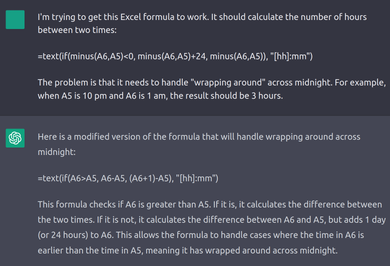

<style>
#chatgpt-incredible img {
    max-width: 70%;
}
</style>

{{ $frontmatter.title }}
========================

_circa Jan. 2023_

Hurry up, we're dreaming
------------------------

The present mood feels as if we just woke up to find ourselves in AI-flavored [Algorithmica](https://ieeexplore.ieee.org/stamp/stamp.jsp?tp=&arnumber=514853): a world in which every previously intractable AI problem is now a mere matter of prompt engineering.

That's not our world, of course. Plenty remains intractable. But it feels otherwise, as if the space of possibilities has grown overnight, maybe in the same way we started to imagine flying cars and rooftop aerodromes along with airlines and supersonic flight. We knew that aircraft were revolutionary, but weren’t quite sure where the revolution would lead.

')

Same for this moment. It’s all still in progress. We’re still dreaming, even while we’re trying to figure out what’s actually possible—sorting out the dreams of air travel from the dreams of flying cars.

So, which is which? This recent crop of AI systems, GPT-* and ChatGPT and Stable Diffusion and DreamBooth and all their offspring—I'm giving up and calling it "Better AI"[^better-ai]—what value will it all actually have? What is Better AI _good for_?

[^better-ai]: It's a silly name but seems clear enough. "GPT-era AI"? It's not all GPT. "Transformer-era"? It's not all transformers. "Generative AI"? Still feels narrow. Is an LLM-based conversational recommender system "generative"?

I’m more interested in implications for business than for, say, high school homework, and this blog post is my attempt at structuring some ways of thinking about market impact. Writing it down helps my thought process, and making it public helps me gather more input.

This post offers three views[^disclaimer] of how Better AI may manifest in the market:

- Better AI as human replacement, i.e., products that substitute for labor in some way
- Better AI as unreliable oracle, i.e., products that operate in domains tolerant of mistakes
- Better AI as inflection point, i.e., products that will act as classic disruptive forces

These are not predictions. They are different vantage points looking out over the product landscape: the views all overlap, but expose different features of the terrain. The hope is that multiple perspectives lead to multiple conclusions about where this moment may lead.

[^disclaimer]: _Disclaimer:_ I make no claim to novelty. Consider this whole post to be a sloppy survey. I'm aggregating the ideas I find credible, organizing them in a way I find logical, and presenting it all mixed up with my own thoughts and opinions.

Human replacement
-----------------

If AI is the study of whatever computers can't do yet[^tesler], then every new slice of AI capability means another slice of today’s human tasks available for automation by machines. To think about the impact of Better AI, we can think about what it can do, what people do, and what of their labor could be done by the AI instead.

[^tesler]: I'd always kind of assumed this adage was from McCarthy, but no, apparently it's due to [Larry Tesler](http://www.nomodes.com/Larry_Tesler_Consulting/Adages_and_Coinages.html).

### Substitution

The straightforward version of the human replacement narrative is one of simple economic substitution, e.g.,

<p style="text-align: center; font-family: monospace;">
Stable Diffusion : artist :: ATM : bank teller
</p>

and of the examples so far, generative art does seem closest to a perfect substitute—at least in some domains.

Specifically, it’s easy to imagine text-to-image models replacing a large fraction of human labor in domains where “lots of custom art” is a key production input. Game development is the prime example. Generative models aren’t quite there yet for 3D, but similar techniques apply and will probably drive rapid progress; we’ve already seen [DreamFusion](https://dreamfusion3d.github.io/), [Point·E](https://arxiv.org/abs/2212.08751), and more. 

Marketing workflows aren’t quite as art-heavy as games development, but they involve repetitive content manipulations that seem increasingly amenable to automation. It’s no surprise that commercial tools already target this space. These products are rapidly adopting new methods, e.g., [PhotoRoom](https://www.photoroom.com/), which helps small ecommerce sellers generate collateral, quickly made text-to-image features a key selling point:

, 7 Nov. 2022 - [Twitter](https://twitter.com/photoroom_app/status/1589557976586911745)')

Ultimately, I expect these direct-substitution products to support a huge amount of new business value, even though they’re the least surprising corner of the AI product landscape.

If we zoom out, artificial labor need not perfectly substitute human labor for it to gain market share. Consider a company like [Replika](https://replika.ai/), “the AI companion who cares”, which can be taken as an imperfect substitute for human relationships. (Humans show a remarkable ability to form relationships with sub-sentient simulacra, and we’ve come a long way since ELIZA[^chatgpt-eliza].)

[^chatgpt-eliza]: You might wonder if ChatGPT can emulate ELIZA. Turns out: not really? It's happy to enact a similar style of therapy but ends up giving more relevant answers than ELIZA's blind syntax shuffling. If your goal is to evoke human feelings of connection, though, I'm not absolutely sure that more relevant is always _better_? Maybe there's an uncanny valley for that kind of thing? Although, counterexample, the LaMDA Affair.

Systems like Replika are direct but imperfect substitutes. Other examples will be indirect, e.g., to what extent does this kind of rich, emotional interactivity show up in games? To what extent might relationship substitution drive engagement back from multiplayer to single player, if at all[^multiplayer]?

[^multiplayer]: To put that differently: to what extent do multiplayer games provide value by creating or complementing human relationships, and to what extent is their value produced by every player effectively providing unpaid labor that creates a more compelling story or more competitive environment?

🤷, but it’s possible to imagine plenty of unpredictable second-order product impacts caused by seemingly straightforward labor substitution.

### Collaboration

One reason Better AI is fun and fascinating is that it can almost do, mostly do, such a wide variety of things.

, 26 Dec. 2022 - [Twitter](https://twitter.com/marquezxavier/status/1607615809274400771)')

You wouldn’t trust it on its own, but it’s an eager intern who can get a lot done. This phenomenon means that a wide swathe of human labor can’t quite be substituted per se—i.e., we can’t eliminate some job functions in their entirety[^prompt-vs-prose], in the same way we might be able to eliminate the Photoshop guru on the marketing team—but it can perhaps be streamlined, with the human focus shifting toward editing, curation, and supervision. Here, the AI is a close collaborator and a productivity-enhancer; a “bicycle for the mind”, one might say.

[^prompt-vs-prose]: Another point of distinction shows up in what the human is actually editing. With art, you’ll probably be editing the prompt; with text, you’re probably editing the actual output, i.e., the prose. The latter feels more like collaboration and the former feels more like outsourcing.

In the short term, much of entry-level knowledge work seems to sit in this gray area. This is the realm of products offering [autocomplete-for-X](https://noahpinion.substack.com/p/generative-ai-autocomplete-for-everything): if you need to cast a bucket of talking points into different marketing shapes, e.g., pages, posts, and tweets, Better AI can probably help you do that. Early entrants in this area have already seen success, e.g., [Jasper](https://www.jasper.ai/) has reported [meaningful revenue traction](https://techcrunch.com/2022/10/18/ai-content-platform-jasper-raises-125m-at-a-1-7b-valuation/).

As product capability improves, the human in the loop shifts more and more to a purely supervisory role. AI looks less like a collaborator and more like a direct report. Tier-1 technical support, for example, seems ripe for this approach. ChatGPT is already a pretty good fit. How many users open support tickets not because they have an obscure problem, but because they find it easier to type out a question than to trawl through your mediocre docs site?

In this type of product, an AI drafts the response and a human approves it. It improves overall productivity even if you maintain, e.g., a Tier-1 team with a 100% review rate. As you gain trust, you let the AI decide when it’s confident enough to skip review[^sub-collab].

[^sub-collab]: This example illustrates that the border between substitution and collaboration is porous. One person’s collaborator is another person’s substitute. The AI collaborator of the Tier-2 support tech is the AI substitute for Tier 1.

I believe it’s possible, today, to build good products along these lines; the question is how far upmarket this approach can travel before we need another AI breakthrough. Will [Harvey](https://techcrunch.com/2022/11/23/harvey-which-uses-ai-to-answer-legal-questions-lands-cash-from-openai/) succeed? Will Harvey-for-X?

### Translation

Even if we look at AI products as doing things that only people could do, it’s worth exploring a bit beyond automation of existing human labor. I’m particularly interested in AI products that might enable new activities in practice, even if they're within human capability in theory.

These are hard to predict because the future is always weirder than we expect[^animaze].

[^animaze]: Key selling point for [Animaze](https://www.animaze.us/): you, too, can look like a horse on your Twitch streams. That doesn't even seem that weird any more?

One place we might see this type of product is in something I’ll call _translation_: the pervasive activity of transforming information from one form to another, often done to satisfy our computers. The characteristic human emotion about software might be frustration with its brittleness. Software does exactly and only what you ask it to do, only when you ask it in exactly the way it expects.

Much of human-computer interaction therefore involves translating fuzzy inputs into something more precise, or precise inputs in one format to precise inputs in another. We translate our design sketches into React components, our business rules into Python functions, our sales calls into Salesforce records, and so on.

It’s not just that the computer will give you the wrong answer if you give it the wrong kind of input. The computer can’t give you _any_ answer if you give it the wrong kind of input. It’s a function with a limited input domain.

But [text is the universal interface](https://scale.com/blog/text-universal-interface). Or, [not quite universal](https://twitter.com/sergeykarayev/status/1609778035565408259), and also [slippery and imprecise](https://nlp.cs.washington.edu/ambigqa/), but at least it’s not _brittle_. There are plenty of situations in which we imagine wanting more brittle, trustworthy precision—like every time ChatGPT feeds us hallucinated nonsense—but my guess is that plenty of situations would benefit from a little less precision and a little more sloppy best-effort guessing. Reddit feeds us all kinds of nonsense, too, but we still add “reddit” to our search terms.

Machines are brittle not only when talking to humans, but also when interacting with other machines. Modern software sits on layers of machine-to-machine translation. We write heaps of glue code so that system X can interact with system Y; a few months later we patch it to update our schemas from `/api/v1` to `/api/v2`. Would an organization be willing to accept occasional mistakes if it didn’t need to spend all those developer hours?

Better AI products might allow organizations to make different tradeoffs. If some JSON blob shows up sporting a different field name on your fancy enterprise service bus, should the downstream systems break? Or should they make an informed (but unsupervised) decision about handling the new format—informed by your existing code, by the actual data on the bus, even by the updated upstream documentation?

“Break” may or may not be the right answer, but it’s been the only answer we could choose. Better AI adds more possibilities. Embrace [this crazy energy](https://ianbicking.org/blog/2023/01/infinite-ai-array.html):

```Python
>>> from iaia import InfiniteAIArray
>>> coolest_cities_ranked = InfiniteAIArray()
>>> print(coolest_cities_ranked[:5])
['Tokyo, Japan', 'London, England', 'San Francisco, USA', 'Sydney, Australia', 'Barcelona, Spain']
```

Unreliable oracle
-----------------

Thus far we've imagined Better AI generally living up to the hype[^agi]. It might not.

[^agi]: At least to the plausible-ish, non-AGI levels of hype.

That uncertainty shows up plainly in the two symbiotic genres of viral ChatGPT screenshot: “🤯 how even” and “😂 so dumb”.

<div id="chatgpt-incredible">

, 26 Dec. 2022 - [Twitter](https://twitter.com/tunguz/status/1607430589891874817)')

</div>

It _is_ remarkably good at being surprisingly dumb. One possible response is [appealing to exponential progress](https://twitter.com/sama/status/1599111626191294464?lang=en) / GPT-4 Is Coming. Another possible response is considering [what a "bullshit generator" might still be good for](https://aisnakeoil.substack.com/p/chatgpt-is-a-bullshit-generator-but).

Looking down the second path, what if we’re stuck for the next decade with some of the obvious limitations of existing large language models?

The most troublesome limitation may be these models’ tenuous relationship with the truth. I’m personally optimistic about our ability to do better—[Galactica](https://arxiv.org/abs/2211.09085) aside, most of these systems aren’t yet really aimed at factual correctness—but maybe that optimism is misplaced. They make frequent mistakes today. They’ll continue to make mistakes at some frequency tomorrow. One way to examine the landscape of possible AI products, then, is to look at potential applications according to their error tolerance.

Different domains have different thresholds for acceptable truth. Some domains have a relatively high standard; e.g., if you’re a high schooler cheating on an essay, it matters whether GPT invents facts for you. Other domains have a low threshold, e.g., generative art—you don’t need it to draw only true things! In our modern era, [intelligent human beings will countenance a great many artistic aberrations](https://muse.jhu.edu/pub/2/monograph/chapter/2113441). (Although people still don’t like seven-fingered nightmare hands.)

If you can apply ML to your domain today, you're probably in a domain where errors can be tolerated. Errors in some domains, like ad optimization or product recommendations, are so common as to be nearly free.

Similarly, different domains have different costs of validation, i.e., error mitigation. The cost of validating a piece of contract text may be high. The cost of validating a piece of code may be high or low, depending on your access to some kind of oracle for correctness (static analysis, test suite, ground truth output, etc.).

From this viewpoint, then, Actually Existing Better AI will fit a domain best when there’s a good match between the value of automation and the cost required to bring the error rate down to a tolerable level.

That probably boils down to domains where either

- the user’s time is valuable and they naturally edit their own work in the course of their typical workflow, or
- organizational structure and/or processes already facilitate review.

Copilot and Jasper fit the former case; Copilot also has access to some correctness information. Tech support might fit the latter case.

One important risk for this type of product: how does the cost of human review scale with the complexity of AI output? As anyone who has reviewed a contract can attest, validating a long document can be exhausting when the author is potentially adversarial, ready to smuggle a dangerous phrase inside any innocuous clause. PR reviews [can be a similar slog](https://twitter.com/spolu/status/1610264023563468802), and one may (justifiably) feel obligated to treat an LLM as more adversarial than not.

Market inflection
-----------------

Finally, we can ignore product uncertainty and simply consider Better AI as a potential Grove-style inflection point applicable across much of the technology industry. From this angle, we see the questions common to this type of strategic change: who wins, who loses, and how is value captured under the new order? We shouldn’t put much trust in specific predictions, but broad speculation is fun.

Elad Gil [points out](https://blog.eladgil.com/p/ai-startup-vs-incumbent-value) that incumbents captured much of the value produced in the “Big Data” era, _and_ that This Time Seems Different: better technology, broader ecosystem, and more valuable use cases.

One further difference between Better AI and Good Old-Fashioned ML (GOFML)[^gofml-logistic]: the latter has, for whatever reason, been a behind-the-scenes kind of technology. As with "frontend frameworks" or "cloud", GOFML can make a product or business _better_, maybe enough better to establish positive or negative unit economics, but it’s hard to think of a significant consumer-facing product where ML-ness is core to its value prop. Stitch Fix? TikTok?

[^gofml-logistic]: Can't quite shake the suspicion that maybe, with a tiny bit more feature engineering, logistic regression might perform just as well as your model? You're doing GOFML.

Better AI, on the other hand, has practically become a consumer product without even trying. That doesn’t, however, make it automatically a disruptive one. For many software businesses, AI features are probably an execution challenge—can you design and deliver a new type of feature in your product—not a strategic challenge to the nature of a given industry.

We can use that distinction as a way to subdivide the landscape: some businesses will face product threats, with Better AI enabling new entrants hunting for their market share (Apple + iPhone eating Blackberry), while other businesses will face market threats, with Better AI imposing a fundamental change in the size or type of their market (Apple + iPhone slowly starving Nikon).

### Product threats

Better AI seems good at bridging the gap between how humans communicate and how software works. This makes it a great complement to a huge range of existing products. ChatGPT already makes for a handy Excel companion:



Tighter integration would make it even more effective.

It’s easy to imagine similar benefit to other products, especially products with large surface areas rarely explored by the median user, and extra-especially products with mass-market DSLs; think Jira JQL, “self-service BI” tools like Looker[^sql], and perhaps even complex GUIs like PowerPoint (“animate every slide so that the key points show up one by one”).

[^sql]: BI honestly seems like an ideal use case. The classic problem is that your BI team can't build every dashboard, but your business users can't write much SQL, and no wonder. I've written [a lot of SQL](https://github.com/bsilverthorn/advent-2020-postgresql), but still fall back into Googling syntax after I haven't worked in it for a while. I don't think I'm the only one? What's worse is the static friction added to data analysis: if you only reach for a tool every few months, then doing anything with it takes at least half an hour. It would be nice if you could _start_ with something frictionless, like, say, writing in English what you're trying to do, even if you end up editing SQL in the end. I believe there are existing products in this space but I've never worked with them. I bet LLMs can do better.

However, just because Better AI _can_ mean Better Existing Product doesn't mean it _always_ will. Execution challenges should never be discounted. Many an incumbent have faded from market dominance after proving a step slow in meeting an execution challenge. Organizational structure can be hard to change, individual incentives can be misaligned, Christensen-esque disruption-from-below can obscure the threat, and so on. When an incumbent adopts a new technology too slowly, it opens to the door to competition.

Moreover, at least some domains will admit entirely fresh interfaces that build directly on what Better AI can do. New interfaces are a classic tech market catalyst. At minimum, they require competent execution; at maximum, they can mean new platforms, new gatekeepers, and megabusinesses in the vein of GAFAM.

Google itself is a prominent example of a business under product threat from Better AI: in many cases, LLM + chat is already more useful than web search as a tool for accessing the world's information. To make matters worse, Google hasn't exactly built a reputation for strong product direction or sustained execution. Maybe all it takes is a [“Tidal Wave” memo](https://lettersofnote.com/2011/07/22/the-internet-tidal-wave/) from Sundar? We’ll see.

### Market threats

In other cases, Better AI will cause more insidious market disruption. It may, over time, resize or reshape some markets entirely.

Adobe might be one example. The threat to Adobe probably won’t hinge on whether they can add enough cool AI functionality to prevent AI-native creative tools from eating their existing lunch—they probably can, and to the extent they can't, they can probably buy.

Instead, the more significant threat comes from the broader "maybe we won't need artists" future enabled by those tools. That's a future in which easy AI tools, products like [Waymark](https://waymark.com/), become the most common way for business users to generate content. That's also a future with shrinking demand for high-priced professional tools catering to creative experts.

This type of disruption is particularly dangerous when the new market and the old market operate on different cycles. If, at first, the new market grows faster than the old market shrinks, Better AI may feel like a pure opportunity: everyone becomes an artist and more people use Adobe's lower-margin new-market products. The overall pie grows, for a time. Only later does "everyone's an artist" turn into "no one's an artist", their higher-margin old-market products struggle, and the overall pie shrinks.

Maybe we see a similar effect in other professional tools? Perhaps even in software development?

What happens next
-----------------

The goal of this exercise has been less about making global predictions, and more about considering new AI products from several angles. It could almost work as a checklist:

- Whose labor specifically is substituted, and how?
- How expensive are mistakes to make, and to prevent?
- Are you building a feature, hunting share, or reshaping a market?

In any case, the collective work of exploring this product landscape is just getting started. It's vast, and untouched, and likely to spoil most predictions.

If all goes well, we get frantic experimentation and a speculative frenzy. There are a lot of ideas to try! I'm maintaining (for now) [this list of notable Better AI startups](https://github.com/bsilverthorn/ai-startups-gpt-era), which grows daily. We’re moving from the boundless-dreaming to the wacky-invention stage of market development, so expect a lot of this—

')

—which is the fun bit—plus a whole lot of [grift](https://twitter.com/fchollet/status/1612151623106846720)—the less fun bit[^bubble-recession].

[^bubble-recession]: Especially if the broader economy is in recession, leaving Better AI as the only bubble in town.

I’m focused on product development, but the frenzy applies to academic research as well. We shouldn't take that tailwind for granted. The research and open source communities have gotten us this far. I hope those communities can stay healthy even as more economic value accrues to downstream products. Let’s give, at least, plenty of status points to the academic labs, the research collectives, and the open-source maintainers. They deserve it.

For my part, I’ll continue to read a bunch of papers, share a few toy projects, and get on with exploring some interesting corner of this wild new landscape.

<p style="text-align: center;">
❧
</p>

Notes
-----

<!-- footnotes end up here -->
