{{ $frontmatter.title }}
========================

_circa Mar. 2023_

[TL;DR: Yes. Expect rough edges. Start with ChatGPT, then give CodiumAI a shot.]

C'mon miracle
-------------

Many programmers enjoy programming. The number who enjoy programming _unit tests_ is somewhat smaller.

No surprise there. Test code can be verbose, repetitive, and boring. The weight of test code commonly exceeds that of application code. And, despite what TDD might preach, tests are often written last, i.e., after you have (you believe) already delivered a large chunk of the short-term business value. Easy to feel like the whole thing is mere box-checking.

A friend recently asked if AI might save us from this drudgery. This post is my answer: a breezy survey of AI tools for generating unit tests.

I've been using Copilot for a while (aren't you?[^copilot-productivity]). Copilot is flexible and it can generate tests if you ask. It's not the only tool for code generation, however, and some tools focus on generating test code specifically. I'll breeze through 4 tools in all:

[^copilot-productivity]: I believe [their marketing survey](https://github.blog/2022-09-07-research-quantifying-github-copilots-impact-on-developer-productivity-and-happiness/).

- [ChatGPT](https://chat.openai.com/chat)
- [CodiumAI](https://www.codium.ai/)
- [TestPilot](https://githubnext.com/projects/testpilot/)
- [Copilot](https://github.com/features/copilot)

[Tabnine](https://www.tabnine.com/) has also [announced a test generation tool](https://www.tabnine.com/test-generation), but I'm still waiting for beta access.

CodiumAI and TestPilot were new to me. This question was an excuse to try them out.

AI is a good fit for test generation
------------------------------------

First, a tangent about test generation as an AI application:

These tools are quite immature, as we'll see, but I believe that test generation fundamentally is a good use case for AI—for many of the same reasons it can be a poor fit for people, i.e., it's verbose, repetitive, and boring.

Current language models are particularly good at producing semi-repetitive structures. If you've used Copilot, you've probably noticed that its sweet spot is generating new instances of a pattern given an earlier example (e.g., implementing `__repr()__` for a new class in the same style as `__repr()__` in your other classes). More generally, "complete this partial list of examples" is the standard way to do few-shot prompting.

When generating unit tests, the language model receives plenty of structured context: at least signature(s) of the code under test; more likely a complete or largely complete implementation. The later in development you add the tests, the more context you give the model.

Better yet, if your application code exists, the AI tool gets a chance to learn more by actually running the tests. As we'll see, ChatGPT can often fix its own bugs if you feed it the errors produced by its code.

Unit tests are perfect for automated execution: each language has a relatively small set of popular test frameworks; tests are designed to be easy to discover and easy to run; and they produce informative error details out of the box. This feature doesn't exist yet (in the tools I've seen), but it will.

Lastly, writing test code can be a slog because we write so much of it. All that code, already out in the world, may be a rich source of model training data.

Code under test
---------------

Our quick-and-dirty methodology: ask each tool to generate unit tests for the same simple function.

Here's the simple function that was lying on top of my pile:

```python
def generate_splits(
        lines: list[str],
        left_fraction: float) -> dict[str, list[str]]:
    shuffled_lines = list(lines)

    random.shuffle(shuffled_lines)

    left_size = int(len(shuffled_lines) * left_fraction)

    return {
        "left": shuffled_lines[:left_size],
        "right": shuffled_lines[left_size:],
    }
```

It's simple enough that any useful tool _should_ be able to generate tests for it, while _just_ deep enough that it might reasonably be worth testing.

Let's try ChatGPT
-----------------

ChatGPT is now "the simplest possible thing that might work"[^joel-grus-talk] for almost any text-mode generative AI problem. Can it generate unit tests for `generate_splits()`? Sure:

[^joel-grus-talk]: It's not simple for OpenAI, but it's [simple](https://www.youtube.com/watch?v=MW9oVxjJHEw) for you.

<span class="torn-edge">

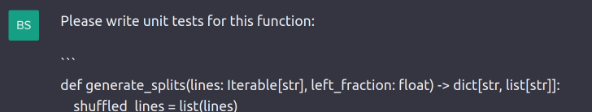

</span>

It produced this code:

```python
import unittest
import random

from your_module import generate_splits


class TestGenerateSplits(unittest.TestCase):
    def test_fraction_0(self):
        lines = ['a', 'b', 'c', 'd', 'e', 'f']
        splits = generate_splits(lines, 0)

        self.assertDictEqual(splits, {'left': [], 'right': lines})

    def test_fraction_1(self):
        lines = ['a', 'b', 'c', 'd', 'e', 'f']
        splits = generate_splits(lines, 1)

        self.assertDictEqual(splits, {'left': lines, 'right': []})

    def test_fraction_0_5(self):
        lines = ['a', 'b', 'c', 'd', 'e', 'f']
        splits = generate_splits(lines, 0.5)

        self.assertEqual(len(splits['left']), len(lines) // 2)
        self.assertEqual(len(splits['right']), len(lines) // 2)
        self.assertCountEqual(splits['left'] + splits['right'], lines)

    def test_shuffle(self):
        lines = ['a', 'b', 'c', 'd', 'e', 'f']
        random.seed(42)
        splits1 = generate_splits(lines, 0.5)

        random.seed(42)
        splits2 = generate_splits(lines, 0.5)

        self.assertEqual(splits1, splits2)


if __name__ == '__main__':
    unittest.main()
```

That's not a bad starting point IMO:

- It thinks up some reasonable test cases.
- It gives them descriptive names.
- It produces straightforward, reasonable-looking code.

But do the tests… pass? Not quite:

```
======================================================================
FAIL: test_fraction_0 (__main__.TestGenerateSplits.test_fraction_0)
----------------------------------------------------------------------
Traceback (most recent call last):
  File "/home/ubuntu/recommender-toy-science/tests.py", line 12, in test_fraction_0
    self.assertDictEqual(splits, {'left': [], 'right': lines})
AssertionError: {'left': [], 'right': ['b', 'f', 'c', 'a', 'e', 'd']} != {'left': [], 'right': ['a', 'b', 'c', 'd', 'e', 'f']}
- {'left': [], 'right': ['b', 'f', 'c', 'a', 'e', 'd']}
?                             -----      ^         ^

+ {'left': [], 'right': ['a', 'b', 'c', 'd', 'e', 'f']}
?                        +++++           ^         ^


======================================================================
FAIL: test_fraction_1 (__main__.TestGenerateSplits.test_fraction_1)
----------------------------------------------------------------------
Traceback (most recent call last):
  File "/home/ubuntu/recommender-toy-science/tests.py", line 18, in test_fraction_1
    self.assertDictEqual(splits, {'left': lines, 'right': []})
AssertionError: {'left': ['b', 'e', 'd', 'c', 'a', 'f'], 'right': []} != {'left': ['a', 'b', 'c', 'd', 'e', 'f'], 'right': []}
- {'left': ['b', 'e', 'd', 'c', 'a', 'f'], 'right': []}
+ {'left': ['a', 'b', 'c', 'd', 'e', 'f'], 'right': []}

----------------------------------------------------------------------
```

The problem is that `generate_splits()` returns each split with its elements in random order, while this test code asserts that input and output are fully identical lists. One could imagine a similar function that does preserve order, but the behavior in this case is intentional.

What now? Feed the errors back to ChatGPT:

<span class="torn-edge">

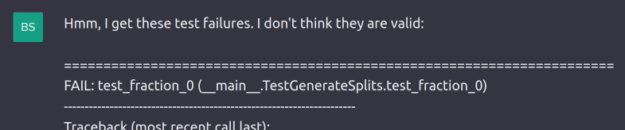

</span>

It understands the bug and offers a solution:

<span class="torn-edge">

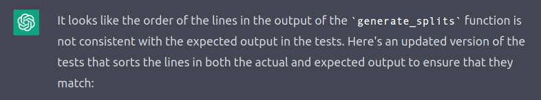

</span>

::: details (see full code output)
```python
import unittest
import random

from your_module import generate_splits


class TestGenerateSplits(unittest.TestCase):
    def test_fraction_0(self):
        lines = ['a', 'b', 'c', 'd', 'e', 'f']
        splits = generate_splits(lines, 0)

        expected_splits = {'left': [], 'right': sorted(lines)}
        actual_splits = {'left': [], 'right': sorted(splits['right'])}

        self.assertDictEqual(actual_splits, expected_splits)

    def test_fraction_1(self):
        lines = ['a', 'b', 'c', 'd', 'e', 'f']
        splits = generate_splits(lines, 1)

        expected_splits = {'left': sorted(lines), 'right': []}
        actual_splits = {'left': sorted(splits['left']), 'right': []}

        self.assertDictEqual(actual_splits, expected_splits)

    def test_fraction_0_5(self):
        lines = ['a', 'b', 'c', 'd', 'e', 'f']
        splits = generate_splits(lines, 0.5)

        expected_splits = {
            'left': sorted(splits['left']),
            'right': sorted(splits['right'])
        }
        actual_splits = {
            'left': sorted(lines[:len(splits['left'])]),
            'right': sorted(lines[len(splits['left']):])
        }

        self.assertDictEqual(actual_splits, expected_splits)

    def test_shuffle(self):
        lines = ['a', 'b', 'c', 'd', 'e', 'f']
        random.seed(42)
        splits1 = generate_splits(lines, 0.5)

        random.seed(42)
        splits2 = generate_splits(lines, 0.5)

        self.assertEqual(splits1, splits2)


if __name__ == '__main__':
    unittest.main()
```
:::

ChatGPT giveth and ChatGPT taketh: it fixes the two failing tests, and also rewrites `test_fraction_0_5()` for no good reason, breaking that test while doing so.

```python
    def test_fraction_0_5(self):
        lines = ['a', 'b', 'c', 'd', 'e', 'f']
        splits = generate_splits(lines, 0.5)

        expected_splits = {
            'left': sorted(splits['left']),
            'right': sorted(splits['right'])
        }
        actual_splits = {
            'left': sorted(lines[:len(splits['left'])]),
            'right': sorted(lines[len(splits['left']):])
        }

        self.assertDictEqual(actual_splits, expected_splits)
```

Oops.

In my experience, it is important to keep your eye on the prize in these situations. You _can_ go another couple rounds with ChatGPT and coax it into correcting this new mistake, but your goal probably isn't “_ChatGPT emits_ the source that I want”, it's more like “_I get_ the source that I want”. Here you reach that goal most easily by ignoring the new broken test and sticking with the old working one.

Now our AI-generated test suite is :green_circle::

```
....
----------------------------------------------------------------------
Ran 4 tests in 0.003s

OK
```

### Completeness

How well is our test suite… testing? There's at least one glaring omission: these tests would pass even if `generate_splits()` returned the same splits every time. Let's fix that.

<span class="torn-edge">

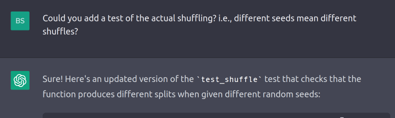

</span>

Again, its behavior is a little odd—it modifies `test_shuffle()` instead of adding a new test—but we can easily correct for that when we paste the new code into our test file.

```python
    def test_shuffle(self):
        lines = ['a', 'b', 'c', 'd', 'e', 'f']
        random.seed(42)
        splits1 = generate_splits(lines, 0.5)

        random.seed(43)
        splits2 = generate_splits(lines, 0.5)

        self.assertNotEqual(splits1, splits2)
```

### Quick take

We've arrived at a reasonable-ish test suite for our simple function. The journey was not perfectly smooth:

- The initial suite contained a couple of failing tests.
- ChatGPT broke a different test while fixing those tests.
- At least one important test was missing.

Overall, though, this workflow still felt like a productivity improvement.

The initial output worked fine as a starting point. It  _probably_ would have saved me a bit of implementation time, on net, even with a few round trips back to ChatGPT. (Or if I'd stuck with manual edits after the first version. The highest productivity risk with ChatGPT might be the entertainment value of playing around with it.)

More importantly, this workflow lends itself to a more abstract thought process[^prompt-strategies]. What test cases does it suggest? What test cases do I want? Those are the kind of questions we want to ask when writing test code—but when you're writing every line of code yourself, it's often easy to focus on implementation concerns instead.

[^prompt-strategies]: You can also try a more sophisticated prompt strategy, e.g., starting with "what should we test?". CodiumAI appears to do something along these lines.

Let's try CodiumAI
------------------

[CodiumAI](https://www.codium.ai/) is focused specifically on generating tests. Click the magic link inside VS Code, and we get some tests:

<span class="torn-edge">

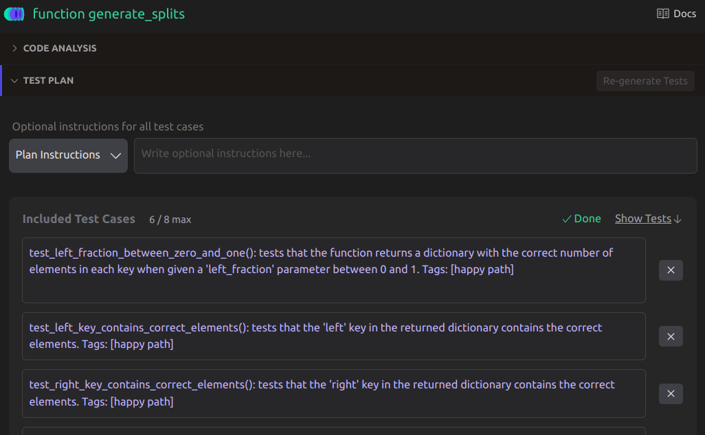

</span>

<span class="torn-edge">

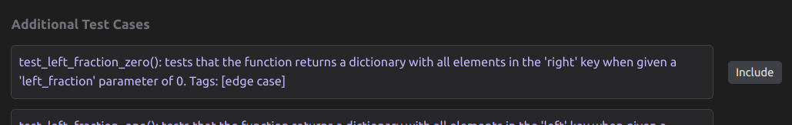

</span>

This interface looks at once familiar and different. The individual test cases look quite similar to what we got out of ChatGPT (although they're using `pytest`), but it produces more of them. In general, the interface is more interactive, more descriptive, and nudges you even more strongly toward making design decisions up front. 

After deciding which tests to include and exclude, we get the following test code

```python
class TestGenerateSplits:
    def test_left_fraction_between_zero_and_one(self):
        lines = ["a", "b", "c", "d", "e"]
        left_fraction = 0.6
        result = generate_splits(lines, left_fraction)
        assert len(result["left"]) == int(len(lines) * left_fraction)
        assert len(result["right"]) == len(lines) - int(len(lines) * left_fraction)

    def test_empty_input(self):
        lines = []
        left_fraction = 0.5
        result = generate_splits(lines, left_fraction)
        assert result == {"left": [], "right": []}

    def test_duplicate_elements(self):
        lines = ["a", "b", "c", "a", "b"]
        left_fraction = 0.4
        result = generate_splits(lines, left_fraction)
        assert len(result["left"]) == int(len(lines) * left_fraction)
        assert len(result["right"]) == len(lines) - int(len(lines) * left_fraction)

    def test_left_fraction_zero(self):
        lines = ["a", "b", "c", "d", "e"]
        left_fraction = 0
        result = generate_splits(lines, left_fraction)
        assert result == {"left": [], "right": lines}

    def test_left_fraction_one(self):
        lines = ["a", "b", "c", "d", "e"]
        left_fraction = 1
        result = generate_splits(lines, left_fraction)
        assert result == {"left": lines, "right": []}
```

which fails with exactly the same mistake made by ChatGPT

```
==================== short test summary info =======================
FAILED tests-codium.py::TestGenerateSplits::test_left_fraction_zero 
- AssertionError: assert {'left': [], ...c', 'd', 'b']} == {'le...
FAILED tests-codium.py::TestGenerateSplits::test_left_fraction_one
- AssertionError: assert {'left': ['b'..., 'right': []} == {'le...
================== 2 failed, 4 passed in 0.28s =====================
```

and can be corrected with a bit of similar guidance:


CodiumAI decides to check list lengths rather than, e.g., comparing sorted lists:

```python
    def test_left_fraction_zero(self):
        lines = ["a", "b", "c", "d", "e"]
        left_fraction = 0
        result = generate_splits(lines, left_fraction)
        assert len(result["left"]) == 0
        assert len(result["right"]) == 5

    def test_left_fraction_one(self):
        lines = ["a", "b", "c", "d", "e"]
        left_fraction = 1
        result = generate_splits(lines, left_fraction)
        assert len(result["left"]) == 5
        assert len(result["right"]) == 0
```

::: details (see full code output)
```python
class TestGenerateSplits:
    def test_left_fraction_between_zero_and_one(self):
        lines = ["a", "b", "c", "d", "e"]
        left_fraction = 0.6
        result = generate_splits(lines, left_fraction)
        assert len(result["left"]) == 3
        assert len(result["right"]) == 2

    def test_empty_input(self):
        lines = []
        left_fraction = 0.5
        result = generate_splits(lines, left_fraction)
        assert len(result) == 0

    def test_duplicate_elements(self):
        lines = ["a", "b", "c", "c", "d", "e"]
        left_fraction = 0.4
        result = generate_splits(lines, left_fraction)
        assert len(result["left"]) == 2
        assert len(result["right"]) == 4

    def test_left_fraction_zero(self):
        lines = ["a", "b", "c", "d", "e"]
        left_fraction = 0
        result = generate_splits(lines, left_fraction)
        assert len(result["left"]) == 0
        assert len(result["right"]) == 5

    def test_left_fraction_one(self):
        lines = ["a", "b", "c", "d", "e"]
        left_fraction = 1
        result = generate_splits(lines, left_fraction)
        assert len(result["left"]) == 5
        assert len(result["right"]) == 0
```
:::

That's probably not the decision I would make, but I'm happy to live with it. Just like ChatGPT, though, it fixes these two implementations while unnecessarily rewriting and breaking an unrelated test:

```python
    def test_empty_input(self):
        lines = []
        left_fraction = 0.5
        result = generate_splits(lines, left_fraction)
        assert len(result) == 0
```

Oops.

```
FAILED tests-codium.py::TestGenerateSplits::test_empty_input - AssertionError: assert 2 == 0
```

:disappointed:

Again we'll need to decide whether to coax the AI-generated output toward overall correctness, or mix-and-match its output ourselves. Right now I recommend the latter.

### Still missing a test

You may have noticed that, even though this initial test suite is more comprehensive, it doesn't ensure pseudorandom behavior—same as our ChatGPT attempt.

The good news is that it's easy to add this test case by providing (even quite vague) instructions:


<p style="text-align: center;">↓</p>

```python
    def test_different_calls_produce_different_splits(self):
        lines = ["a", "b", "c", "d", "e"]
        left_fraction = 0.5
        result1 = generate_splits(lines, left_fraction)
        result2 = generate_splits(lines, left_fraction)
        assert result1 != result2
```

### Observations about implementation details

If you're tinkering with LLMs, you may find it interesting to see bits of prompt design made visible in CodiumAI.

They generate "Code Analysis" and "Test Plan" as bulleted lists. Here they are with slightly nicer formatting:

> Code Analysis:
> - The main functionality of the function is to generate two splits of a given iterable of strings, one for the left fraction and one for the right fraction.
> - The left fraction is determined by the input parameter `left_fraction`, which is a float between 0 and 1 representing the fraction of lines to be included in the left split.
> - The function shuffles the input iterable of strings randomly using the `random.shuffle()` method.
> - It then calculates the size of the left split by multiplying the length of the shuffled iterable by the `left_fraction` parameter and rounding down to the nearest integer using the `int()` function.
> - The function returns a dictionary with two keys, `left` and `right`, each containing a list of strings representing the left and right splits respectively. 
> - The `left` key contains the first `left_size` elements of the shuffled iterable, while the `right` key contains the remaining elements.
> - The function is useful for tasks such as splitting a dataset into training and validation sets, or for generating random samples from a larger dataset.

This analysis is presumably one stage of their underlying prompt chain. It describes the function accurately but rather verbosely. It's probably more important for more complex code under test.

The test plan is presumably the next stage:

> Test Plan:
> - test_left_fraction_between_zero_and_one(): tests that the function returns a dictionary with the correct number of elements in each key when given a `left_fraction` parameter between 0 and 1. Tags: [happy path]
> - test_empty_input(): tests that the function returns an empty dictionary when given an empty iterable. Tags: [edge case]
> - test_duplicate_elements(): tests that the function correctly splits an iterable with duplicate elements. Tags: [general behavior]
> - test_left_fraction_zero(): tests that the function returns a dictionary with all elements in the `right` key when given a `left_fraction` parameter of 0. Tags: [edge case]
> - test_left_fraction_one(): tests that the function returns a dictionary with all elements in the `left` key when given a `left_fraction` parameter of 1. Tags: [edge case]
> - different calls produce different splits
>
> Additional instructions:
> - remember that the output lists are shuffled

We can see our inputs included in that plan.

You can also see a "tags" system labeling each test with a general category ("happy path", "edge case", etc.). That's mildly interesting information as a user, but my guess is that it is used primarily as a prompting strategy to generate more diverse test suites.

### Quick take

CodiumAI doesn't seem significantly better than ChatGPT at generating low-level test code, but the UI porcelain _does_ make for a significantly nicer workflow.

For example, despite the code-level regression I noted above, it felt much easier to iterate on the test suite—continuing to operate on the test plan, not the test code, for as long as possible—because the set of test cases remained stable across iterations.

Let's try TestPilot
-------------------

Next up is TestPilot, a feature of GitHub's [Copilot Labs](https://githubnext.com/projects/copilot-labs).

Install it in VS Code, fire up the sidebar, find the "Test Generation" section, and hit:

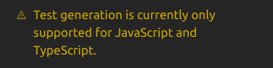

No problem! We'll convert our code using ChatGPT:

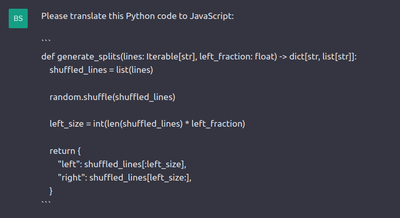

After giving it some guidance on replacing `shuffle()`, we end up with a decent-looking JavaScript translation:

```javascript
function generate_splits(lines, left_fraction) {
  const shuffled_lines = [...lines];

  shuffled_lines.sort(() => Math.random() - 0.5);

  const left_size = Math.floor(shuffled_lines.length * left_fraction);

  return {
    "left": shuffled_lines.slice(0, left_size),
    "right": shuffled_lines.slice(left_size),
  };
}
```

Is it correct? Sure would be nice to have a few tests…

Let's mash this button and generate some:


<p style="text-align: center;">↓ × 4</p>

```javascript
describe('test tests_testpilot', function() {
    it('test tests-testpilot.generate_splits', function(done) {
        let lines = [1, 2, 3, 4, 5, 6, 7, 8, 9, 10];
        let left_fraction = 0.5;
        let expected = {"left":[4, 8, 5, 9, 7, 1], "right":[10, 2, 3, 6]};
        let result = tests_testpilot.generate_splits(lines, left_fraction);
        assert.deepEqual(result, expected);
        done();
    })
})

describe('test tests_testpilot', function() {
    it('test tests-testpilot.generate_splits', function(done) {
        let lines = ['a', 'b', 'c', 'd', 'e'];
        let left_fraction = 0.5;
        let expected = {
            "left": ['a', 'b', 'c'],
            "right": ['d', 'e']
        };
        let actual = tests_testpilot.generate_splits(lines, left_fraction);
        assert.deepEqual(actual, expected);
        done();
    })
})

describe('test tests_testpilot', function() {
    it('test tests-testpilot.generate_splits', function(done) {
        let lines = [1, 2, 3, 4, 5, 6, 7, 8, 9, 10];
        let left_fraction = 0.5;
        let splits = tests_testpilot.generate_splits(lines, left_fraction);
        assert.equal(splits["left"].length, 5);
        assert.equal(splits["right"].length, 5);
        done();
    })
})

describe('test tests_testpilot', function() {
    it('test tests-testpilot.generate_splits', function(done) {
        let lines = [
            "line1",
            "line2",
            "line3",
            "line4",
            "line5",
            "line6",
            "line7",
            "line8",
            "line9",
            "line10",
            // …
            // you get the idea
            // …
            "line236",
]    })
})
```

Yeah, those are not great[^other-attempts].

### Quick take

Maybe skip TestPilot for now.

[^other-attempts]: I've seen it generate other examples that don't even call the function under test.

Let's try Copilot
-----------------

What about vanilla Copilot? Isn't "generating code" kind of its whole thing?

Indeed[^test-example-marketing]:

[^test-example-marketing]: "Create unit tests" is one of the three use cases highlighted in [marketing material](https://web.archive.org/web/20230301143250/https://marketplace.visualstudio.com/items?itemName=GitHub.copilot).

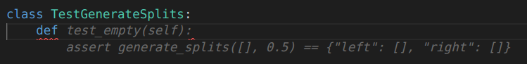

As always, Copilot may run off in an unhelpful direction if you don't keep it on a leash:

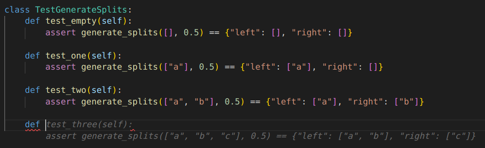

Using the [Ctrl+Enter](https://docs.github.com/en/copilot/configuring-github-copilot/configuring-github-copilot-in-visual-studio-code#keyboard-shortcuts-for-github-copilot) "suggestions pane" is a good way to steer this process:

<span class="torn-edge">

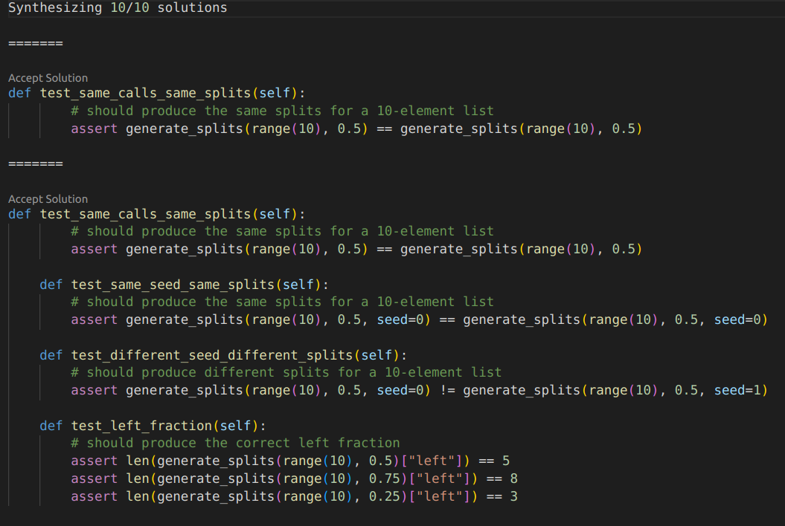

</span>

You can also sketch a test plan in a comment block, along the lines of CodiumAI's prompt chain, but I'm not sure it's worth it:

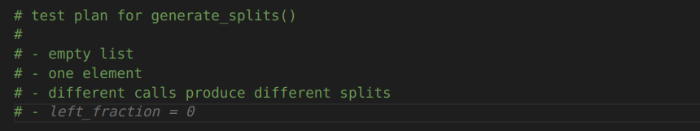

### Shuffle bug

Note that Copilot's `test_two()` implementation makes the same mistake—forgetting that inputs are shuffled—as ChatGPT and Codium both made at first. You _can_ add comments guiding it toward a better solution, e.g.:

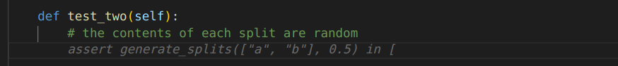

<p style="text-align: center;">↓</p>

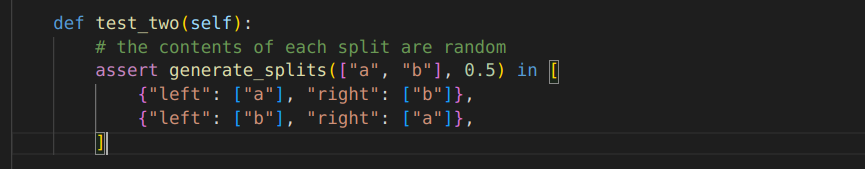

That may or may not be worth the trouble, especially because Copilot (per my impression) requires slightly stronger guidance than other models.

### Quick take

Copilot is a fine partner if you'll otherwise write the test suite manually. If you're hoping for more support, though, I'd start with a different option, then apply Copilot on the finishing touches.

_Should_ AI write your tests?
-----------------------------

This point is obvious but I feel obligated to emphasize it: tests provide value in multiple ways.

First, they provide value by _testing_, i.e., by catching bugs, especially regressions. One typical argument for unit testing is that it decreases change risk and thus increases the development velocity of your team.

You could still get this value even if an AI tool wrote all your tests, by itself, without your involvement. (As long as it does a decent job.)

Second, however, tests provide value by improving your application code. Proponents of unit testing also make this argument: testable code is better-designed code; the act of writing tests helps you understand and improve your own code, especially when you iterate between writing your tests and refactoring your application.

This value goes away if an AI tool writes all your tests.

The extent to which you find test-generation tools appealing will depend on the extent to which you believe each of the arguments above. In practice, of course, the more likely options may be “generated tests” or “no tests”, not “small-batch artisanal tests”.

Regardless, these tradeoffs lie in the future. Today's tools require much more oversight—even for this type of self-contained code ideal for unit testing.

Wrapping up
-----------

Can AI write your unit tests?

Yes, AI tools can design relevant test suites and generate useful test code today, at least in simple situations. Some of the code is even correct. These tools are likely to make your test development process a bit more productive.

You may hope, however, for something more holistic: a helpful and vigilant AI coworker, well-versed in your entire codebase, aware of what's tested and not tested, writing tests for the not-tested stuff, running those tests, uncovering bugs and telling you how to fix them. There's nothing like that yet, AFAIK, but we are headed in that direction.

<p style="text-align: center;">
❧
</p>

Notes
-----

<!-- footnotes end up here -->
