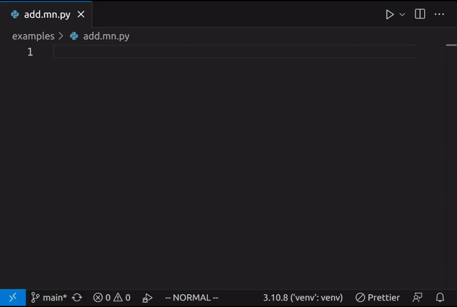

{{ $frontmatter.title }}
========================

_circa Aug. 2023_

[TL;DR: Check out [Maccarone](https://github.com/bsilverthorn/maccarone).]

Make you better
---------------

I've been playing with a specific idea in LLM-assisted programming: can we maintain a program more easily by annotating its source code to include LLM guidance?

Maccarone is a side project where I've tried that out. Some resources:

- [GitHub project](https://github.com/bsilverthorn/maccarone)
- [VS Code extension](https://marketplace.visualstudio.com/items?itemName=maccarone.maccarone)
- [Notes on Twitter](https://twitter.com/bcsilverthorn/status/1693730779225100648)

And here's what it looks like:

This idea is pretty simple[^missing-pieces], but it changes the operating model from "the LLM gives me code for my program" to "the LLM owns some parts of the program". An analogy might be task assignment vs role delegation in the context of management.

[^missing-pieces]: Disclaimer: the implementation in Maccarone is also pretty bare-bones. It doesn't pull in context outside the current file, you have to manually refresh AI-managed code blocks, and so on.

Task assignment, i.e., pasting in code from an LLM (or tab-completing it), feels a bit like writing your application in assembly and occasionally pasting in output from your compiler. Stay in the highest-level language you have for as long as you can! Today, in the GPT era, our highest-level language is English.

Not sure if _this_ model feels right, either, but I'd love to see more people experimenting with new developer experiences. We won't still be programming with code + copilot + chat in 2030, will we?

Notes
-----

<!-- footnotes end up here -->
